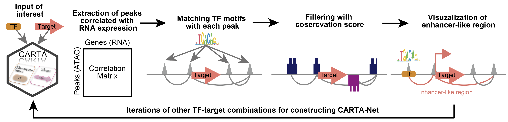

# CARTA

<!-- badges: start -->
<!-- badges: end -->



<<<<<<< Updated upstream
CARTA (Connected Accessible Regions by input of the combination between Transcription factor and tArget) , similar to the traditional Japanese card game, where the upper phrase is read and then matched with the lower phrase, can extract candidate enhancer regions by inputting combinations of Tramscoription factor (TF) and target.
=======
CARTA (Connected Accessible Regions by input of the combination between Transcription factor and tArget) , similar to the traditional Japanese card game, where the upper phrase is read and then matched with the lower phrase, can extract candidate enhancer regions by inputting combinations of TF and target.
>>>>>>> Stashed changes

CARTA is R package to construct cis-regulatory networks (CARTA-Net), extracting TF-binding motifs within enhancer-like regions that positively correlate with gene expression, are co-accessible with TSSs, and are highly conserved across mammals, using only TF-target combinations of interest as input. <br>
CARTA is designed for single-cell multiome data analysis under Seurat and Signac environment.


## Citation
CARTA is now open in bioRxiv. Please cite the below paper.
https://www.biorxiv.org/content/10.1101/2025.11.09.687497v1


## Installation

You can install the development version of CARTA from [GitHub](https://github.com/) with:

``` r
# install.packages("pak")
pak::pak("iaki-dev/CARTA")
```

## Tutorial 1: Create CARTA-Net

This is a basic example which shows you how to create CARTA-Net.

``` r
library(CARTA)
library(Seurat)
library(Signac)
library(EnsDb.Mmusculus.v79)
library(GenomeInfoDb)
library(tidyverse)
library(GenomicRanges)
library(future)
library(ggplot2)
library(patchwork)
library(BSgenome.Mmusculus.UCSC.mm10)
library(motifmatchr)
set.seed(1234)
library(data.table)
library(progress)
library(JASPAR2022)
library(TFBSTools)
"%not.in%" <- Negate("%in%")

# Load your data including scRNA-seq and scATAC-seq on each slot.
gexatac_merge <- readRDS("seuratobj.rds")
DimPlot(gexatac_merge, reduction = "umap.rpca")
DefaultAssay(gexatac_merge) <- "ATAC"
df.genome <- data.frame(gexatac_merge[["ATAC"]]@annotation)
genome <- BSgenome.Mmusculus.UCSC.mm10


# Motif matching with peaks of scATAC-seq
search.peaks <- gexatac_merge[["ATAC"]]@ranges

opts <- list()
opts[["tax_group"]] <-  "vertebrates"
opts[["all_versions"]] <- FALSE
PFMatrixList <- getMatrixSet(JASPAR2022, opts)
PFMatrixList

motif_pos <- matchMotifs(PFMatrixList, search.peaks, genome = genome,  out = c("positions"))
saveRDS(motif_pos, "motif_pos.rds")
# motif_pos <- readRDS("motif_pos.rds")

tfs <- maketfmotiftable(PFMatrixList = PFMatrixList)
tfs2 <- cleantfmotiftable(tfs =tfs)

gexatac_merge <- RegionStats(gexatac_merge, genome = BSgenome.Mmusculus.UCSC.mm10)

# It takeks about 4 hours!
gexatac_merge <- LinkPeaks(
  object = gexatac_merge,
  peak.assay = "ATAC",
  expression.assay = "RNA",
  genes.use = rownames(gexatac_merge@assays$RNA)
)


# Markers detection
DefaultAssay(gexatac_merge) <- "RNA"
marker_rna <- FindAllMarkers(gexatac_merge, only.pos = T)
write_tsv(marker_rna, "markers_rna.txt")

DefaultAssay(gexatac_merge) <- "ATAC"
marker_atac<- FindAllMarkers(gexatac_merge, only.pos = T)
write_tsv(marker_atac, "markers_atac.txt")

DefaultAssay(gexatac_merge) <- "ATAC"


# Calculate the TF to be used for the network from here.
using_genes <- paste(substr(tfs2$name, 1, 1), tolower(substr(tfs2$name, 2, nchar(tfs2$name))), sep = "")
using_genes <- using_genes %>% unique() %>% sort()


# Limit to genes that are expressed, i.e., using.genes is limited to only transcription factors that are expressed.
df_avg <- AverageExpression(object = gexatac_merge, group.by = "seurat_clusters")$RNA %>% as.data.frame()
exp.genes <- df_avg %>%
  filter(if_any(everything(), ~ .x >= 0.1))
using_genes <- intersect(rownames(exp.genes), using_genes) %>% sort()
length(using_genes)

# Filtering marker genes
tmp.markers <- markers_rna %>% dplyr::filter(avg_log2FC > 0.2,
                                         p_val < 1e-3)

df.genome_genes <- df.genome$gene_name
markers_sub <- intersect(tmp.markers$gene, df.genome_genes)


# RNA-RNA correlation
goi <- c(using_genes, markers_sub) %>% unique()
exp.data <- df_avg[goi,] %>% t()
cor_matrix <- corSparse(exp.data)
rownames(cor_matrix) <- colnames(exp.data)
colnames(cor_matrix) <- colnames(exp.data)
df_cor <- as.data.frame(cor_matrix) %>%
  rownames_to_column("Variable")
# Convert data frame to tidy form
tidy_cor_matrix <- df_cor %>%
  gather(key="Variable2", value="Correlation", -Variable)
colnames(tidy_cor_matrix) <- c("TF", "target", "Correlation")

write_tsv(tidy_cor_matrix, "tidy_cor_matrix.txt")
nrow(tidy_cor_matrix)

tidy_cor_matrix <- tidy_cor_matrix %>% dplyr::filter(Correlation > 0,
                                                     TF %in% using_genes,
                                                     target %in% markers_sub)
nrow(tidy_cor_matrix)
write_tsv(tidy_cor_matrix, "tidy_cor_matrix_filt.txt")
# tidy_cor_matrix <- read_tsv("tidy_cor_matrix_filt.txt")

# Summarizing gene information
df.genome_group <- df.genome %>%
  dplyr::group_by(gene_name, strand, seqnames) %>%
  summarise(
    chr.min = min(start, end),
    chr.max = max(start, end),
  ) %>%
  ungroup() %>% dplyr::filter(strand %in% c("+", "-"),
                              !gene_name == "")


# Filtering by RNA-ATAC correlation of links
links.df <- data.frame(gexatac_merge[["ATAC"]]@links)
links.df <- links.df %>% filter(score > 0.1)
# Detection of specific peaks
tmp.markers_atac <- markers_atac %>% dplyr::filter(avg_log2FC > 0.1,
                                                   p_val < 0.01)
# Filter links in advance as one of the DAPs
links.df <- links.df %>% dplyr::filter(peak %in% tmp.markers_atac$gene)


tidy_cor_matrix <- tidy_cor_matrix %>% mutate(TFFORID = toupper(TF))


# Added progress bar
pb <- progress_bar$new(
  format = "  Processing [:bar] :percent in :elapsed",
  total = nrow(tidy_cor_matrix), clear = FALSE, width = 60
)


# Creating CARTA-Net needs almost 6h.
CARTA_Net <- tidy_cor_matrix %>%
  mutate(MotifID = map(.x = TFFORID,
                       .f = ~tfs2 %>%
                         dplyr::filter(name == .x) %>%
                         pull(ID))) %>%
  unnest(MotifID) %>%
  mutate(result = pmap(list(seuratobj = list(gexatac_merge),
                            df.genome = list(df.genome),
                            target = target,
                            tfs2 = list(tfs2),
                            id = MotifID),
                       function(seuratobj, df.genome, target, tfs2, id) {
                         if (!pb$finished) {
                           pb$tick()
                         }
                         CreateCARTANet(seuratobj, df.genome, target, tfs2, id)
                       })) %>% unnest(result)
write_tsv(CARTA_Net, "CARTA_Net.txt")


# conservation filtering
# test_bw <-  "~/workspace/mm10.60way.phastCons60wayEuarchontoGlire.bw"
# gr <- import(test_bw)
# gr <- gr[seqnames(gr) %in% standardChromosomes(gr)]
# gr_df <- as.data.frame(gr)
# saveRDS(gr_df, "mm10.60way.phastCons60wayEuarchontoGlire.bw_df.rds")
# mm10.60way.phastCons60wayEuarchontoGlire.bw_df.rds is more than 10 GB data.
gr_df <- readRDS("mm10.60way.phastCons60wayEuarchontoGlire.bw_df.rds")
gr_df$seqnames <- as.character(gr_df$seqnames)
gr_df$start %>% class
# [1] "integer"
gr_df$end %>% class
# [1] "integer"

nrow(CARTA_Net)


library(GenomicRanges)
library(dplyr)

gr1 <- GRanges(
  seqnames = gr_df$seqnames,
  ranges = IRanges(start = gr_df$start, end = gr_df$end),
  score = gr_df$score
)

gr2 <- GRanges(
  seqnames = CARTA_Net$seqnames_motif,
  ranges = IRanges(start = CARTA_Net$start_motif, end = CARTA_Net$end_motif)
)

hits <- findOverlaps(gr2, gr1)
avg_scores <- tapply(gr1$score[subjectHits(hits)],
                     INDEX = queryHits(hits),
                     FUN = mean, na.rm = TRUE)

CARTA_Net$avg_conservation_score <- NA
CARTA_Net$avg_conservation_score[as.integer(names(avg_scores))] <- avg_scores

write.table(CARTA_Net, "CARTA_Net_conservation_score.txt", quote = F, sep = "\t", row.names = F)


```


## Tutorial2: Summarize CARTA-Net output

This is a basic example which shows you how to summarize of CARTA-Net results.

``` r

setwd("~/workspace/data/Multiome_Wnt1/Merge_Wnt1/v14/LogNormAll/1st/filtered")
NCC_merge <- readRDS("gexatac_merge_NCC_mes.rds")
DimPlot(gexatac_merge, reduction = "umap.rpca")

links.df <- data.frame(gexatac_merge[["ATAC"]]@links)
links.df <- links.df %>% dplyr::filter(score > 0)

Idents(gexatac_merge) <- gexatac_merge@meta.data$region2
markers_atac <- FindAllMarkers(gexatac_merge, assay = "ATAC")
write_tsv(markers_atac, "markers_atac.txt")


# Pharyngeal
setwd("~/workspace/data/Multiome_Wnt1/Merge_Wnt1/v14/LogNormAll/1st/filtered/peaks/CARTA_Net/v6/")
CARTA_Net <- read_tsv("CARTA_Net_conservation_score.txt")  
dim(CARTA_Net)
# [1] 950035     26
CARTA_Net <- CARTA_Net %>% dplyr::filter(avg_conservation_score > 0.8)
dim(CARTA_Net)
# [1] 14612     26
CARTA_Net <- CARTA_Net %>% dplyr::filter(peak %in% links.df$peak)
setwd("~/workspace/data/Multiome_Wnt1/Merge_Wnt1/v14/LogNormAll/1st/filtered/peaks/CARTA_Net/")
markers <- read_tsv("markers_region2.txt")
markers <- markers %>% dplyr::filter(avg_log2FC > 0.5,
                                     p_val < 1e-4)
markers_sub <- markers %>% dplyr::filter(cluster == "Pharyngeal")
df_avg_atac <- AverageExpression(object = gexatac_merge,  group.by = "region2")$ATAC %>% as.data.frame()
df_avg_atac <- df_avg_atac %>% dplyr::filter(`Cardiac-Cushion` > 0.5)
markers_atac <- read_tsv("markers_atac.txt")
markers_atac <- markers_atac %>% dplyr::filter(cluster == "Pharyngeal", avg_log2FC > 0)
df_avg_atac <- df_avg_atac[markers_atac$gene,]

df_avg_rna <- AverageExpression(object = gexatac_merge,  group.by = "region2")$RNA %>% as.data.frame()
df_avg_rna <- df_avg_rna %>% dplyr::filter(`Cardiac-Cushion` > 0.3)
CARTA_Net_Pharyngeal <- CARTA_Net %>% dplyr::filter(target %in% markers_sub$gene, 
                                                         TF %in% rownames(df_avg_rna),
                                                         peak %in% rownames(df_avg_atac))
CARTA_Net_Pharyngeal$name_ID <- paste(CARTA_Net_Pharyngeal$TF, CARTA_Net_Pharyngeal$MotifID, sep = "_")
CARTA_Net_Pharyngeal$region <- "Pharyngeal"


# Transitional
setwd("~/workspace/data/Multiome_Wnt1/Merge_Wnt1/v14/LogNormAll/1st/filtered/peaks/CARTA_Net/v6/")
CARTA_Net <- read_tsv("CARTA_Net_conservation_score.txt")  
dim(CARTA_Net)
# [1] 950035     26
CARTA_Net <- CARTA_Net %>% dplyr::filter(avg_conservation_score > 0.8)
dim(CARTA_Net)
# [1] 141712     26
CARTA_Net <- CARTA_Net %>% dplyr::filter(peak %in% links.df$peak)
setwd("~/workspace/data/Multiome_Wnt1/Merge_Wnt1/v14/LogNormAll/1st/filtered/peaks/CARTA_Net/")
markers <- read_tsv("markers_region2.txt")
markers <- markers %>% dplyr::filter(avg_log2FC > 0.5,
                                     p_val < 1e-4)
markers_sub <- markers %>% dplyr::filter(cluster == "Transitional")
df_avg_atac <- AverageExpression(object = gexatac_merge,  group.by = "region2")$ATAC %>% as.data.frame()
df_avg_atac <- df_avg_atac %>% dplyr::filter(`Cardiac-Cushion` > 0.5)
markers_atac <- read_tsv("markers_atac.txt")
markers_atac <- markers_atac %>% dplyr::filter(cluster == "Transitional", avg_log2FC > 0)
df_avg_atac <- df_avg_atac[markers_atac$gene,]

df_avg_rna <- AverageExpression(object = gexatac_merge,  group.by = "region2")$RNA %>% as.data.frame()
df_avg_rna <- df_avg_rna %>% dplyr::filter(`Cardiac-Cushion` > 0.3)

CARTA_Net_Transitional <- CARTA_Net %>% dplyr::filter(target %in% markers_sub$gene, 
                                                    TF %in% rownames(df_avg_rna),
                                                    peak %in% rownames(df_avg_atac))
CARTA_Net_Transitional$name_ID <- paste(CARTA_Net_Transitional$TF, CARTA_Net_Transitional$MotifID, sep = "_")
CARTA_Net_Transitional$region <- "Transitional"


# Cardiac_Cushion
setwd("~/workspace/data/Multiome_Wnt1/Merge_Wnt1/v14/LogNormAll/1st/filtered/peaks/CARTA_Net/v6/")
CARTA_Net <- read_tsv("CARTA_Net_conservation_score.txt")  
dim(CARTA_Net)
# [1] 950035     26
CARTA_Net <- CARTA_Net %>% dplyr::filter(avg_conservation_score > 0.8)
dim(CARTA_Net)
# [1] 14612     26
CARTA_Net <- CARTA_Net %>% dplyr::filter(peak %in% links.df$peak)
setwd("~/workspace/data/Multiome_Wnt1/Merge_Wnt1/v14/LogNormAll/1st/filtered/peaks/CARTA_Net/")
markers <- read_tsv("markers_region2.txt")
markers <- markers %>% dplyr::filter(avg_log2FC > 0.5,
                                     p_val < 1e-4)
markers_sub <- markers %>% dplyr::filter(cluster == "Cardiac_Cushion")
df_avg_atac <- AverageExpression(object = gexatac_merge,  group.by = "region2")$ATAC %>% as.data.frame()
df_avg_atac <- df_avg_atac %>% dplyr::filter(`Cardiac-Cushion` > 0.5)
markers_atac <- read_tsv("markers_atac.txt")
markers_atac <- markers_atac %>% dplyr::filter(cluster == "Cardiac_Cushion", avg_log2FC > 0)
df_avg_atac <- df_avg_atac[markers_atac$gene,]

df_avg_rna <- AverageExpression(object = gexatac_merge,  group.by = "region2")$RNA %>% as.data.frame()
df_avg_rna <- df_avg_rna %>% dplyr::filter(`Cardiac-Cushion` > 0.3)

CARTA_Net_Cardiac_Cushion <- CARTA_Net %>% dplyr::filter(target %in% markers_sub$gene, 
                                                    TF %in% rownames(df_avg_rna),
                                                    peak %in% rownames(df_avg_atac))
CARTA_Net_Cardiac_Cushion$name_ID <- paste(CARTA_Net_Cardiac_Cushion$TF, CARTA_Net_Cardiac_Cushion$MotifID, sep = "_")
CARTA_Net_Cardiac_Cushion$region <- "Cardiac_Cushion"


# Subvalvular
setwd("~/workspace/data/Multiome_Wnt1/Merge_Wnt1/v14/LogNormAll/1st/filtered/peaks/CARTA_Net/v6/")
CARTA_Net <- read_tsv("CARTA_Net_conservation_score.txt")  
dim(CARTA_Net)
# [1] 950035     26
CARTA_Net <- CARTA_Net %>% dplyr::filter(avg_conservation_score > 0.8)
dim(CARTA_Net)
# [1] 14612     26
CARTA_Net <- CARTA_Net %>% dplyr::filter(peak %in% links.df$peak)
setwd("~/workspace/data/Multiome_Wnt1/Merge_Wnt1/v14/LogNormAll/1st/filtered/peaks/CARTA_Net/")
markers <- read_tsv("markers_region2.txt")
markers <- markers %>% dplyr::filter(avg_log2FC > 0.5,
                                     p_val < 1e-4)
markers_sub <- markers %>% dplyr::filter(cluster == "Subvalvular")

df_avg_atac <- AverageExpression(object = gexatac_merge,  group.by = "region2")$ATAC %>% as.data.frame()
df_avg_atac <- df_avg_atac %>% dplyr::filter(`Cardiac-Cushion` > 0.5)
markers_atac <- read_tsv("markers_atac.txt")
markers_atac <- markers_atac %>% dplyr::filter(cluster == "Subvalvular", avg_log2FC > 0)
df_avg_atac <- df_avg_atac[markers_atac$gene,]
                           
df_avg_rna <- AverageExpression(object = gexatac_merge,  group.by = "region2")$RNA %>% as.data.frame()
df_avg_rna <- df_avg_rna %>% dplyr::filter(`Cardiac-Cushion` > 0.3)

CARTA_Net_Subvalvular <- CARTA_Net %>% dplyr::filter(target %in% markers_sub$gene, 
                                                    TF %in% rownames(df_avg_rna),
                                                    peak %in% rownames(df_avg_atac))
CARTA_Net_Subvalvular$name_ID <- paste(CARTA_Net_Subvalvular$TF, CARTA_Net_Subvalvular$MotifID, sep = "_")
CARTA_Net_Subvalvular$region <- "Subvalvular"


# AP_septum
setwd("~/workspace/data/Multiome_Wnt1/Merge_Wnt1/v14/LogNormAll/1st/filtered/peaks/CARTA_Net/v6/")
CARTA_Net <- read_tsv("CARTA_Net_conservation_score.txt")  
dim(CARTA_Net)
# [1] 950035     26
CARTA_Net <- CARTA_Net %>% dplyr::filter(avg_conservation_score > 0.8)
dim(CARTA_Net)
# [1] 14612     26
CARTA_Net <- CARTA_Net %>% dplyr::filter(peak %in% links.df$peak)
setwd("~/workspace/data/Multiome_Wnt1/Merge_Wnt1/v14/LogNormAll/1st/filtered/peaks/CARTA_Net/")
markers <- read_tsv("markers_region2.txt")
markers <- markers %>% dplyr::filter(avg_log2FC > 0.5,
                                     p_val < 1e-4)
markers_sub <- markers %>% dplyr::filter(cluster == "AP_septum")
df_avg_atac <- AverageExpression(object = gexatac_merge,  group.by = "region2")$ATAC %>% as.data.frame()
df_avg_atac <- df_avg_atac %>% dplyr::filter(`Cardiac-Cushion` > 0.5)
markers_atac <- read_tsv("markers_atac.txt")
markers_atac <- markers_atac %>% dplyr::filter(cluster == "AP_septum", avg_log2FC > 0)
df_avg_atac <- df_avg_atac[markers_atac$gene,]

df_avg_rna <- AverageExpression(object = gexatac_merge,  group.by = "region2")$RNA %>% as.data.frame()
df_avg_rna <- df_avg_rna %>% dplyr::filter(`Cardiac-Cushion` > 0.3)

CARTA_Net_AP_septum <- CARTA_Net %>% dplyr::filter(target %in% markers_sub$gene, 
                                                    TF %in% rownames(df_avg_rna),
                                                    peak %in% rownames(df_avg_atac))
CARTA_Net_AP_septum$name_ID <- paste(CARTA_Net_AP_septum$TF, CARTA_Net_AP_septum$MotifID, sep = "_")
CARTA_Net_AP_septum$region <- "AP_septum"


# SMC_GA
setwd("~/workspace/data/Multiome_Wnt1/Merge_Wnt1/v14/LogNormAll/1st/filtered/peaks/CARTA_Net/v6/")
CARTA_Net <- read_tsv("CARTA_Net_conservation_score.txt")  
dim(CARTA_Net)
# [1] 950035     26
CARTA_Net <- CARTA_Net %>% dplyr::filter(avg_conservation_score > 0.8)
dim(CARTA_Net)
# [1] 14612     26
CARTA_Net <- CARTA_Net %>% dplyr::filter(peak %in% links.df$peak)
setwd("~/workspace/data/Multiome_Wnt1/Merge_Wnt1/v14/LogNormAll/1st/filtered/peaks/CARTA_Net/")
markers <- read_tsv("markers_region2.txt")
markers <- markers %>% dplyr::filter(avg_log2FC > 0.5,
                                     p_val < 1e-4)
markers_sub <- markers %>% dplyr::filter(cluster == "SMC_GA")
df_avg_atac <- AverageExpression(object = gexatac_merge,  group.by = "region2")$ATAC %>% as.data.frame()
df_avg_atac <- df_avg_atac %>% dplyr::filter(`Cardiac-Cushion` > 0.5)
markers_atac <- read_tsv("markers_atac.txt")
markers_atac <- markers_atac %>% dplyr::filter(cluster == "SMC_GA", avg_log2FC > 0)
df_avg_atac <- df_avg_atac[markers_atac$gene,]

df_avg_rna <- AverageExpression(object = gexatac_merge,  group.by = "region2")$RNA %>% as.data.frame()
df_avg_rna <- df_avg_rna %>% dplyr::filter(`Cardiac-Cushion` > 0.3)

CARTA_Net_SMC_GA <- CARTA_Net %>% dplyr::filter(target %in% markers_sub$gene, 
                                                    TF %in% rownames(df_avg_rna),
                                                    peak %in% rownames(df_avg_atac))
CARTA_Net_SMC_GA$name_ID <- paste(CARTA_Net_SMC_GA$TF, CARTA_Net_SMC_GA$MotifID, sep = "_")
CARTA_Net_SMC_GA$region <- "SMC_GA"


# SMC_DA
setwd("~/workspace/data/Multiome_Wnt1/Merge_Wnt1/v14/LogNormAll/1st/filtered/peaks/CARTA_Net/v6/")
CARTA_Net <- read_tsv("CARTA_Net_conservation_score.txt")  
dim(CARTA_Net)
# [1] 950035     26
CARTA_Net <- CARTA_Net %>% dplyr::filter(avg_conservation_score > 0.8)
dim(CARTA_Net)
# [1] 14612     26
CARTA_Net <- CARTA_Net %>% dplyr::filter(peak %in% links.df$peak)
setwd("~/workspace/data/Multiome_Wnt1/Merge_Wnt1/v14/LogNormAll/1st/filtered/peaks/CARTA_Net/")
markers <- read_tsv("markers_region2.txt")
markers <- markers %>% dplyr::filter(avg_log2FC > 0.5,
                                     p_val < 1e-4)
markers_sub <- markers %>% dplyr::filter(cluster == "SMC_DA")

df_avg_atac <- AverageExpression(object = gexatac_merge,  group.by = "region2")$ATAC %>% as.data.frame()
df_avg_atac <- df_avg_atac %>% dplyr::filter(`Cardiac-Cushion` > 0.5)
markers_atac <- read_tsv("markers_atac.txt")
markers_atac <- markers_atac %>% dplyr::filter(cluster == "SMC_DA", avg_log2FC > 0)
df_avg_atac <- df_avg_atac[markers_atac$gene,]

df_avg_rna <- AverageExpression(object = gexatac_merge,  group.by = "region2")$RNA %>% as.data.frame()
df_avg_rna <- df_avg_rna %>% dplyr::filter(`Cardiac-Cushion` > 0.3)

CARTA_Net_SMC_DA <- CARTA_Net %>% dplyr::filter(target %in% markers_sub$gene, 
                                                    TF %in% rownames(df_avg_rna),
                                                    peak %in% rownames(df_avg_atac))
CARTA_Net_SMC_DA$name_ID <- paste(CARTA_Net_SMC_DA$TF, CARTA_Net_SMC_DA$MotifID, sep = "_")
CARTA_Net_SMC_DA$region <- "SMC_DA"


# SMC_CA
setwd("~/workspace/data/Multiome_Wnt1/Merge_Wnt1/v14/LogNormAll/1st/filtered/peaks/CARTA_Net/v6/")
CARTA_Net <- read_tsv("CARTA_Net_conservation_score.txt")  
dim(CARTA_Net)
# [1] 950035     26
CARTA_Net <- CARTA_Net %>% dplyr::filter(avg_conservation_score > 0.8)
dim(CARTA_Net)
# [1] 14612     26
CARTA_Net <- CARTA_Net %>% dplyr::filter(peak %in% links.df$peak)
setwd("~/workspace/data/Multiome_Wnt1/Merge_Wnt1/v14/LogNormAll/1st/filtered/peaks/CARTA_Net/")
markers <- read_tsv("markers_region2.txt")
markers <- markers %>% dplyr::filter(avg_log2FC > 0.5,
                                     p_val < 1e-4)
markers_sub <- markers %>% dplyr::filter(cluster == "SMC_CA")
df_avg_atac <- AverageExpression(object = gexatac_merge,  group.by = "region2")$ATAC %>% as.data.frame()
df_avg_atac <- df_avg_atac %>% dplyr::filter(`Cardiac-Cushion` > 0.5)
markers_atac <- read_tsv("markers_atac.txt")
markers_atac <- markers_atac %>% dplyr::filter(cluster == "SMC_CA", avg_log2FC > 0)
df_avg_atac <- df_avg_atac[markers_atac$gene,]

df_avg_rna <- AverageExpression(object = gexatac_merge,  group.by = "region2")$RNA %>% as.data.frame()
df_avg_rna <- df_avg_rna %>% dplyr::filter(`Cardiac-Cushion` > 0.3)

CARTA_Net_SMC_CA <- CARTA_Net %>% dplyr::filter(target %in% markers_sub$gene, 
                                                    TF %in% rownames(df_avg_rna),
                                                    peak %in% rownames(df_avg_atac))
CARTA_Net_SMC_CA$name_ID <- paste(CARTA_Net_SMC_CA$TF, CARTA_Net_SMC_CA$MotifID, sep = "_")
CARTA_Net_SMC_CA$region <- "SMC_CA"


setwd("~/workspace/data/Multiome_Wnt1/Merge_Wnt1/v14/LogNormAll/1st/filtered/peaks/CARTA_Net/v6/")
CARTA_Net_summarize <- bind_rows(CARTA_Net_Pharyngeal,CARTA_Net_Transitional,CARTA_Net_Cardiac_Cushion,
                                 CARTA_Net_Subvalvular,CARTA_Net_AP_septum,
                                 CARTA_Net_SMC_GA, CARTA_Net_SMC_DA, CARTA_Net_SMC_CA)
write_tsv(CARTA_Net_summarize, "CARTA_Net_summarize_filt_conservation.txt")


# The results of CARTA_Net indicated the combinatation between TF and target gene associated with the locus of enhancer-like reigons matcing with TF-binding motifs.
# The peak colomn indicated the peak of scATAC-seq.
# The colomns of seqnames_motif, start_motif, end_motif, and sequence_motif indicatedd the TF-binding motif site.
# The avg_conservation_score indicated the homologous region among the sepcies you analyzed.

CARTA_Net_summarize %>%
  head(3) %>%
  print(width = Inf)

# A tibble: 3 × 28
  TF     target Correlation TFFORID MotifID  seqnames    start      end  width strand score gene 
  <chr>  <chr>        <dbl> <chr>   <chr>    <chr>       <dbl>    <dbl>  <dbl> <chr>  <dbl> <chr>
1 Plagl1 Barx1       0.622  PLAGL1  MA1615.1 chr13    48662998 48717198  54201 *      0.152 Barx1
2 Ctcf   Bnc2        0.531  CTCF    MA1930.1 chr4     84356981 84675275 318295 *      0.148 Bnc2 
3 Elf1   Bnc2        0.0816 ELF1    MA0473.3 chr4     84454756 84675275 220520 *      0.100 Bnc2 
  peak                    zscore      pvalue peak_seqnames peak_start peak_end seqnames_motif start_motif
  <chr>                    <dbl>       <dbl> <chr>              <dbl>    <dbl> <chr>                <dbl>
1 chr13-48716699-48717696   4.82 0.000000708 chr13           48716699 48717696 chr13             48717127
2 chr4-84356452-84357509    4.08 0.0000229   chr4            84356452 84357509 chr4              84357439
3 chr4-84454286-84455225    2.38 0.00874     chr4            84454286 84455225 chr4              84454794
  end_motif width_motif strand_motif score_motif sequence_motif                      avg_conservation_score
      <dbl>       <dbl> <chr>              <dbl> <chr>                                                <dbl>
1  48717139          13 -                  10.2  CCTGACCCCAGCA                                        0.875
2  84357473          35 -                   7.52 GGAAGAAGCCTTCTGCCAAAGACTGCAAACTGCAG                  1.000
3  84454807          14 +                  11.4  AAGAAGGAAGTCGG                                       0.988
  name_ID         region    
  <chr>           <chr>     
1 Plagl1_MA1615.1 Pharyngeal
2 Ctcf_MA1930.1   Pharyngeal
3 Elf1_MA0473.3   Pharyngeal


``` 


## Tutorial 3: Visualization of CARTA-Net output

This is a basic example which shows you how to visualization of CARTA-Net results.

``` r

# Load data
gexatac_merge <- readRDS("gexatac_merge_region.rds")
df.genome <- data.frame(gexatac_merge[["ATAC"]]@annotation)

CARTA_Net_summarize <- read_tsv("CARTA_Net_conservation_score.txt")

TFi <- "Meis2" # Transcription fator of interst
goi <- "Sox9" # target gene of interest
target <- goi
roi <- CARTA_Net_summarize %>% dplyr::filter(target == goi, TF == TFi)


visualize_region.tmp <- visualize_region(seuratobj = gexatac_merge, df.genome = df.genome,  target = target,
                                         ranges.links.final = roi)
visualize_highlight.tmp <- visualize_highlight(seuratobj = gexatac_merge, df.genome = df.genome,  target = target,
                                               ranges.links.final = roi)
# There are too many links, so they will be only included those connected to the target TSS.
seuratobj.tmp <- gexatac_merge # temporal copy
target.links.df <- data.frame(seuratobj.tmp[["ATAC"]]@links)
# Extract only those items in target.links.df that correspond to links.df.
target.links.df <- target.links.df %>% dplyr::filter(gene == target)

# Convert from dataframe to granges
links.granges <-makeGRangesFromDataFrame(target.links.df,
                                         keep.extra.columns=T,
                                         ignore.strand=FALSE,
                                         seqinfo=NULL,
                                         seqnames.field=c("seqnames", "seqname",
                                                          "chromosome", "chrom",
                                                          "chr", "chromosome_name",
                                                          "seqid"),
                                         start.field="start",
                                         end.field=c("end", "stop"),
                                         strand.field="strand",
                                         starts.in.df.are.0based=FALSE)

Links(seuratobj.tmp) <- links.granges
CoveragePlot(seuratobj.tmp, region = visualize_region.tmp,
             region.highlight = visualize_highlight.tmp,
             peaks = T, links = T,
             features = goi,
             expression.assay = "RNA",
)

ggsave(paste(TFi, "_", goi, ".pdf", sep = ""), width = 6, height = 4)

gc();gc()


```


